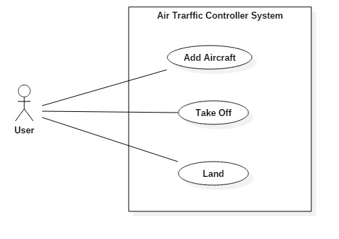
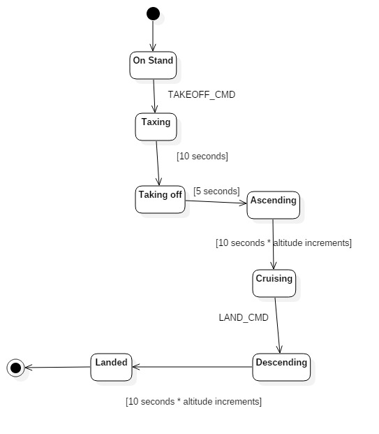
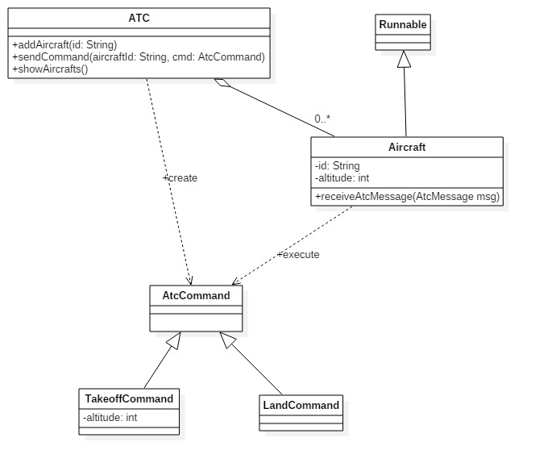

# ✈️ Air Traffic Control System 🛫

Creating a simplified air traffic control (ATC) system which allows users to add airplanes and control them.

## Use Case Diagram 📊

## Aircraft State Machine Diagram 🛠️

## ATC Class Diagram 📝

## Requirements 📋

- When an added aircraft is in "On Stand" state, it waits for a command from ATC.
- After receiving a takeoff command, the aircraft enters the "Taxing" state and stays there for 10 seconds.
- From "Taxing," the aircraft transitions to the "Taking off" state and stays for 5 seconds.
- The takeoff command includes the cruising altitude for the aircraft.
- Aircraft stays in the "Ascending" state until it reaches the cruising altitude. Altitude is given by ATC in 1,000 meters increments, requiring 10 seconds for each increment.
- The aircraft can receive a land command only when it is at cruising altitude.
- Descending is done in 1,000 meters increments.
- When the aircraft reaches altitude 0, it is considered landed.
- The aircraft keeps track of the number of seconds spent in the "Cruising" state and displays it after landing.

## Implementation Details 🛠️

- User interaction is done through a console-based user interface.
- Aircraft objects are implemented as threads.
- After an aircraft lands, the thread will be finished.
- Wait()/notify() mechanisms are used to implement the waiting mechanism for aircraft to receive ATC commands.
